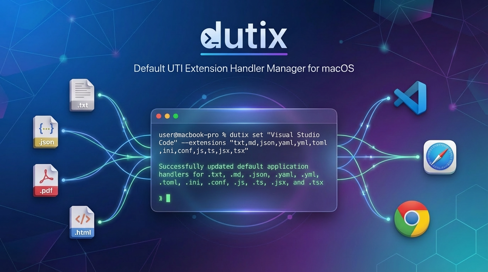
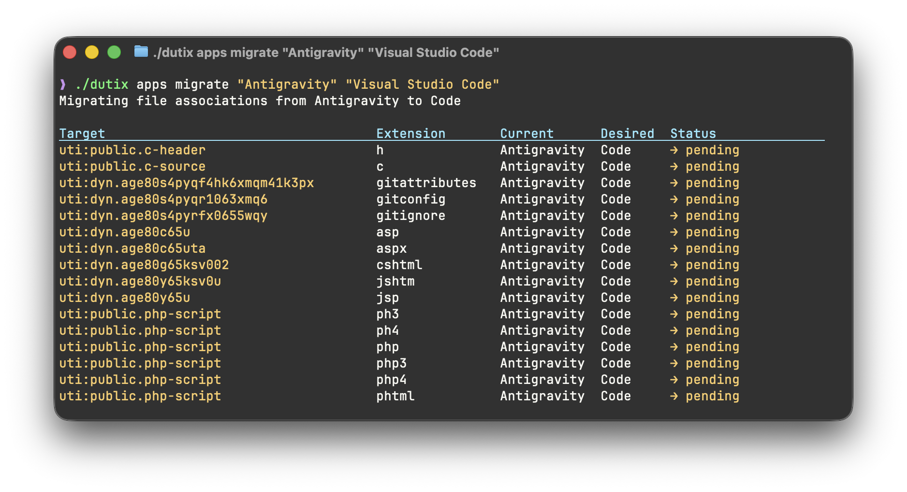

# dutix

[](https://github.com/jackchuka/dutix/actions)
[](https://goreportcard.com/report/github.com/jackchuka/dutix)



**dutix** (Default UTI eXtension handler manager) is a command-line tool for managing default application handlers for file types, UTIs (Uniform Type Identifiers), and URL schemes on macOS.

## Features

- 🎯 Set default applications for file extensions, UTIs, and URL schemes
- 🔄 Migrate all file associations from one app to another
- 📋 List and inspect installed applications and their capabilities
- 🔍 Query current default handlers for any file type or URL scheme
- 🛡️ Safe operations with preview, confirmation, and dry-run modes
- 📊 Multiple output formats (table, JSON, YAML)
- 🚀 Fast native macOS integration



## Requirements

- macOS 12.0 (Monterey) or later
- Go 1.25 or later (for building from source)

## Installation

### Homebrew

```bash
brew install jackchuka/tap/dutix
```

### From Source

```bash
# Go install
go install github.com/jackchuka/dutix/cmd/dutix@latest

# Clone and build
git clone https://github.com/jackchuka/dutix.git
cd dutix
go build -o dutix ./cmd/dutix/
```

## Quick Start

```bash
# Set VS Code as default for text files
dutix set "Visual Studio Code" --extensions txt,md,json

# Check what handles .txt files
dutix targets show txt

# Migrate all file associations from one app to another
dutix apps migrate TextEdit "Visual Studio Code"

# List all installed applications
dutix apps list
```

## Usage

### Global Flags

Available on all commands:

| Flag       | Short | Description                               |
| ---------- | ----- | ----------------------------------------- |
| `--debug`  | —     | Enable debug logging                      |
| `--quiet`  | `-q`  | Suppress non-essential output             |
| `--output` | `-o`  | Output format: `table`, `json`, or `yaml` |

### Commands

#### `dutix set <app> [flags]`

Set default application for file extensions, UTIs, or URL schemes.

**Flags:**

- `--extensions` - Comma-separated file extensions (e.g., `txt,md,json`)
- `--utis` - Comma-separated UTI identifiers (e.g., `public.plain-text`)
- `--schemes` - Comma-separated URL schemes (e.g., `http,https`)
- `--dry-run` - Preview changes without applying
- `--yes` - Skip confirmation prompt

**Examples:**

```bash
# Set default for file extensions
dutix set "Visual Studio Code" --extensions txt,md,json

# Set default for URL schemes
dutix set Safari --schemes http,https

# Preview changes first
dutix set TextEdit --extensions txt --dry-run

# Skip confirmation
dutix set Finder --extensions zip,tar --yes
```

#### `dutix apps list [flags]`

List all installed applications.

**Flags:**

- `--filter` - Filter by name or path (case-insensitive)

**Examples:**

```bash
# List all applications
dutix apps list

# Find specific app
dutix apps list --filter "Visual"

# JSON output
dutix apps list --output json
```

#### `dutix apps show <app-name>`

Show detailed information about an application including supported file types and UTIs.

**Examples:**

```bash
dutix apps show "Visual Studio Code"
dutix apps show Safari --output json
```

#### `dutix apps migrate <from-app> <to-app> [flags]`

Migrate all file type associations from one application to another.

**Flags:**

- `--dry-run` - Preview migration without applying changes
- `--yes` - Skip confirmation prompt

**Examples:**

```bash
# Preview migration
dutix apps migrate TextEdit "Visual Studio Code" --dry-run

# Migrate with confirmation
dutix apps migrate TextEdit "Visual Studio Code"

# Auto-migrate without prompts
dutix apps migrate "Old App" "New App" --yes
```

#### `dutix targets show <target>`

Show current default handler for a file extension, UTI, or URL scheme.

The command automatically detects the target type:

- Extensions: `txt`, `json`, `pdf`
- UTIs: `public.plain-text`, `public.json`
- Schemes: `http`, `https`, `mailto`

**Examples:**

```bash
# Check file extension
dutix targets show txt

# Check UTI
dutix targets show public.plain-text

# Check URL scheme
dutix targets show http
```

#### `dutix version`

Display version information including git commit and build date.

```bash
dutix version
```

## Common Use Cases

### Setting Up a New Code Editor

```bash
# Set VS Code as default for common development files
dutix set "Visual Studio Code" --extensions \
  "txt,md,json,yaml,yml,toml,ini,conf,\
  js,ts,jsx,tsx,mjs,\
  py,rb,go,rs,java,c,cpp,h,hpp,\
  html,css,scss,sass"

# Preview first with dry-run
dutix set "VS Code" --extensions txt,md --dry-run
```

### Switching from One App to Another

```bash
# Migrate everything from TextEdit to VS Code
dutix apps migrate TextEdit "Visual Studio Code"

# Preview the migration first
dutix apps migrate Safari Chrome --dry-run
```

### Setting Default Web Browser

```bash
# Set Safari as default browser
dutix set Safari --schemes http,ftp,ftps

# Set Chrome
dutix set "Google Chrome" --schemes http
```

### Checking Current Defaults

```bash
# What opens .txt files?
dutix targets show txt

# What opens HTTP links?
dutix targets show http

# Get JSON output for scripting
dutix targets show txt --output json --quiet
```

### Finding App Capabilities

```bash
# See what file types an app supports
dutix apps show "Visual Studio Code"

# Find apps by name
dutix apps list --filter code

# Get machine-readable output
dutix apps show Safari --output json
```

## Output Formats

### Table (Default)

Human-readable formatted tables:

```bash
dutix apps list
```

### JSON

Machine-parseable JSON output:

```bash
dutix apps list --output json
dutix targets show txt --output json | jq '.defaultApp'
```

### YAML

Structured YAML output:

```bash
dutix apps show "Visual Studio Code" --output yaml
```

## Development

### Project Structure

```
dutix/
├── cmd/dutix/           # Application entry point
├── internal/
│   ├── cli/            # CLI commands and subcommands
│   ├── domain/         # Business logic (planner, applier)
│   ├── formatter/      # Output formatters (table, JSON, YAML)
│   ├── logger/         # Logging utilities
│   └── macos/          # macOS bridge layer
```

### Build Commands

```bash
export CGO_ENABLED=1

# Build
go build -o dutix ./cmd/dutix/

# Test
go test ./...

# Lint
golangci-lint run ./...

# Generate mocks
go generate ./...
```

## How It Works

dutix relies on [macos-apphandlers-bridge](https://github.com/jackchuka/macos-apphandlers-bridge) to interface with macOS AppKit APIs for querying and setting default application handlers.

The tool uses a three-phase approach:

1. **Plan** - Resolves targets and queries current defaults
2. **Preview** - Shows what will change before applying
3. **Apply** - Makes the changes to system defaults

## Known Limitations

- Some system-protected defaults (like http) may require user confirmation in System Settings
- Changes to certain defaults may not be reflected immediately in all applications
- Requires running as the logged-in user (not sandboxed)
- Some system-internal UTIs are automatically filtered out during migration
- `public.html` UTI cannot be set programmatically and is automatically skipped

## License

[MIT License](LICENSE)

## Contributing

Contributions welcome! See [docs/DEVELOPMENT.md](docs/DEVELOPMENT.md) for development guidelines.

## Credits

Inspired by:

- [duti](https://github.com/moretension/duti) - Command-line default handler manager

Built with:

- [Cobra](https://github.com/spf13/cobra) - CLI framework
- [tablewriter](https://github.com/rodaine/table) - Table formatting
- [macos-apphandlers-bridge](https://github.com/jackchuka/macos-apphandlers-bridge) - macOS integration
